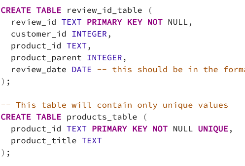

# Big Data: Using AWS & PySpark to Extract, Transform and Load Data

For this project, I used Amazon Web Services (AWS) to create a Managed Relational Database Service (RDS) and hosted a cloud-based Scalable Storage (S3) account.  Using PySpark run in Google CoLab notebook to clean up the DataFrame, and connect the data from the cloud to my local PostgreSQL tables.  

# Overview

The project's goal was to take over a gigabyte of TSV data from Amazon’s paid review program Vine and analyze the findings to test if there is an inherent bias towards more favorable five-star reviews for paid reviews.  

## Extract

First the data had to be extracted from AWS using PySpark and read into a DataFrame using google CoLab as shown here: 

  

## Transform
A lot of the work on this project happened using PySpark to transform the data.  As you can see, all the data was read in as a string, however, as you can see from the SQL query setting up the table schema, the end data will need to be in a few different formats.  

      

Last, the DataFrame needs to be transformed into four different DataFrames to match our tables.  

  

## Load
The last step is to load the data from the temporary Spark session to the local PostgreSQL connection and into the existing tables.

  

## Analysis 
The second deliverable dealt with analyzing the reviews for outdoor equipment specifically, the difference between the paid (vine) program outcomes for five-star reviews, and unpaid reviews.  
	
- For products with 20 or more reviews, there were 107 vine-reviewed products compared to 39,869 unpaid products. 

- Of these, 56 vine-reviewed products earned a five-star rating compared to 21,005 non-vine-reviewed products. 

- Interestingly, this lead to an also identical percentage of five-star reviews, with *52.33%* paid to *52.68%* unpaid five-star review findings, respectively.  

# Summary
In summary, for outdoor equipment there is no evidence for a bias towards five-star ratings for vine-reviewed products. One complication in the analysis is the order of magnitude difference between the number of paid and unpaid reviews.  A shift of only a few paid reviews from four- to five-stars would have changed the results significantly.   

  
